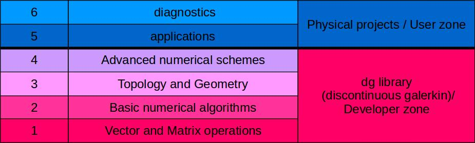

# Welcome
This tutorial explains how to use Feltor in your programs.
The tutorial's structure follows the basic structure of the library as described 
further down.
If you want, you can also follow a
[lecture by Matthias Wiesenberger](https://events.prace-ri.eu/event/989/sessions/3081/attachments/1199/2017/Wiesenberger_PRACE_high.mp4) held at the PRACE winter school on
GPU programming in Innsbruck (unfortunately takes some time to load).
If you haven't done so yet, please read the
[Quick Start Guide](https://github.com/feltor-dev/feltor) first, which
explains how to install the library and compile programs (you do not
need jsoncpp, glfw3 or netcdf to complete the tutorial).

## What is FELTOR?

FELTOR (Full-F ELectromagnetic code in TORoidal geometry) is a modular
scientific software package that can roughly be divided into six parts described as follows

### User Zone:
A collection of actual simulation projects and diagnostic
programs for two- and three-dimensional drift- and gyro-fluid models

6. Diagonstics:

These programs are designed to analyse the output from the application programs

5. Applications:

Programs that execute two- and three-dimensional simulations: read in input file(s), simulate, and either write results to disk or directly visualize them on screen. Some examples led to journal [publications](https://feltor-dev.github.io/publications) in the past.

### Developper Zone
The core dg library of optimized numerical algorithms
and functions centered around discontinuous Galerkin methods on structured grids. Can be used as a standalone library.

4. Advanced algorithms:

Numerical schemes that are based on the existence of a geometry and/or a topology. These include notably the discretization of elliptic equations in arbitrary coordinates, multigrid algorithms and the flux coordinate independent approach in arbitrary coordinates (available through the _geometries_ extension _path/to/feltor/inc/geometries/geometries.h_).

3. Topology and Geometry:

Here, we introduce data structures and functions that represent the concepts of Topology and Geometry and operations defined on them (for example the discontinuous Galerkin discretization of derivatives). The _geometries_ extension implements a large variety of grids and grid generation algorithms that can be used here.

2. Basic algorithms:

Algorithms like conjugate gradient (CG) or Runge-Kutta schemes that can be implemented with linear algebra functions alone.

1. Vector and Matrix operations:

In this "hardware abstraction" level we define the interface for various vector and matrix operations like additions, multiplications, scalar products and so on. These functions are then implemented  and optimized on a variety of hardware architectures and serve as building blocks for all higher
level algorithms.

