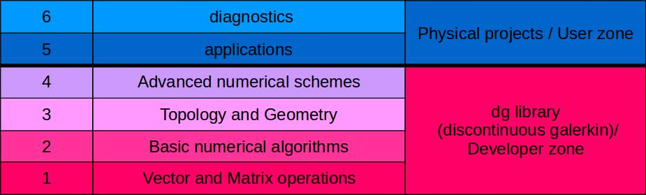

# Welcome
This guide explains how to use Feltor.
It's structure follows the basic structure of Feltor itself as described 
further below.
If you want, you can also follow a
[lecture by Matthias Wiesenberger](https://events.prace-ri.eu/event/989/sessions/3081/attachments/1199/2017/Wiesenberger_PRACE_high.mp4) held at the PRACE winter school on
GPU programming in Innsbruck (unfortunately takes some time to load).
If you haven't done so yet, please read the
[Quick Start Guide](https://github.com/feltor-dev/feltor) first, which
explains how to install the library and compile programs.

```{note}
This guide is generated using [jupyter-book](https://jupyterbook.org/intro.html) from [jupyter-notebooks](https://jupyter.org/) with the [xeus-cling](https://github.com/jupyter-xeus/xeus-cling) extension, which allows to run C++ code in a jupyter-notebook. This means that you can download and execute the notebooks yourself and we encourage you to do so and play around with the provided examples. Or, you can simply copy-paste the code examples into a textfile and compile the code yourself.

Unfortunately, xeus-cling does not generate terribly fast code and only works unparallelized so compiling yourself probably yields faster executables.
```

```{seealso}
You can look up any class or function beginning with `dg::` in the [doxygen documentation](https://feltor-dev.github.io/doc/dg/html/modules.html)
```

## What is FELTOR?

FELTOR (Full-F ELectromagnetic code in TORoidal geometry) is a modular
scientific software package that can roughly be divided into six parts described as follows. 



The core dg library `dg/algorithm.h` is a **header-only** template C++ library, which provides the core elements of the first four levels in the above structure

FELTOR currently ships with three **extensions** to the basic dg library.
- `dg/geometries/geometries.h` adds several grid generators, magnetic field structure and the flux-coordinate independent approach (levels 3 and 4).
- `dg/file/file.h` simplifies common I/O operations in our programs (level 5 and 6).
- `dg/exblas/exblas.h` is special because it is already included in the dg library (level 1) but can also be used as a standalone library. It provides binary reproducible and accurate scalar products on various architectures.

### User Zone:
A collection of actual simulation projects and diagnostic
programs for two- and three-dimensional drift- and gyro-fluid models

<span>6.<span> Diagonstics:

These programs are designed to analyse the output from the application programs

<span>5.<span> Applications:

Programs that execute two- and three-dimensional simulations: read in input file(s), simulate, and either write results to disk or directly visualize them on screen. Some examples led to journal [publications](https://feltor-dev.github.io/publications) in the past.

### Developper Zone
The core dg library of optimized numerical algorithms
and functions centered around discontinuous Galerkin methods on structured grids. Can be used as a standalone library.

<span>4.<span> Advanced algorithms:

Numerical schemes that are based on the existence of a geometry and/or a topology. These include notably the discretization of elliptic equations in arbitrary coordinates, multigrid algorithms and the flux coordinate independent approach in arbitrary coordinates (available through the _geometries_ extension `dg/geometries/geometries.h`).

<span>3.<span> Topology and Geometry:

Here, we introduce data structures and functions that represent the concepts of Topology and Geometry and operations defined on them (for example the discontinuous Galerkin discretization of derivatives). The _geometries_ extension implements a large variety of grids and grid generation algorithms that can be used here.

<span>2.<span> Basic algorithms:

Algorithms like conjugate gradient (CG) or Runge-Kutta schemes that can be implemented with linear algebra functions alone.

<span>1.<span> Vector and Matrix operations:

In this "hardware abstraction" level we define the interface for various vector and matrix operations like additions, multiplications, scalar products and so on. These functions are then implemented  and optimized on a variety of hardware architectures and serve as building blocks for all higher
level algorithms.


```python

```
